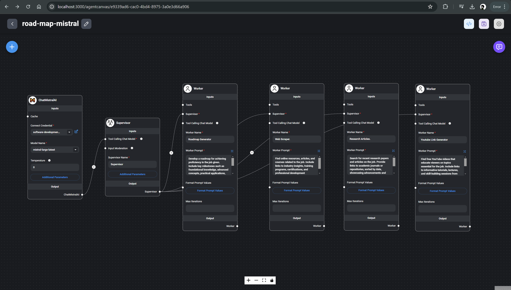

# Yoda - Your Learning Assistant

Yoda is an AI-powered learning assistant designed to create personalized learning roadmaps for any job role you're interested in. It helps you explore new career opportunities, gain new skills, and stay ahead in your field.

## Overview

This project utilizes advanced AI agents and web scraping tools to generate comprehensive roadmaps for achieving proficiency in a given job role. It leverages Flowise AI to create an interactive, automated workflow.

### Workflow



### Features

- **ChatMistralAI:** Acts as the conversational AI agent to interact with users and gather job role inputs.
- **Supervisor Agent:** Coordinates and manages tasks among different agents in the workflow.
- **Roadmap Generator Agent:** Develops structured roadmaps based on job role inputs and required skills.
- **Web Scraper Agent:** Collects online resources, articles, and courses related to the job role.
- **Research Articles Agent:** Searches for recent research papers and academic journals relevant to the job role.
- **YouTube Link Generator Agent:** Finds educational YouTube videos related to job skills.

## Getting Started

To run this project locally, ensure Flowise AI is installed and running on `localhost:3000`.

### Prerequisites

- Node.js
- Flowise AI (installed and running on localhost:3000)

### Installation

1. Clone the repository:

   ```bash
   git clone https://github.com/your/repository.git
   cd repository-name

2. Install Flowise
   ```bash
   npm install -g flowise

3. Start the server
```bash
npx flowise start
```

4. install and set up Flowise AI on localhost:3000 before interacting with Yoda from the deployed application at https://yoda-roadmap.vercel.app/. This ensures the AI agents are ready to provide the intended functionality seamlessly.

## Usage
Once the development server is running and Flowise AI is set up:

- **Open** your browser and navigate to the development server address.
- **Click** on "Talk to Yoda" to initiate the conversation.
- **Please** make sure to input the job role you're interested in.
- **Wait** for Yoda to generate a curated roadmap tailored to your career goals.
